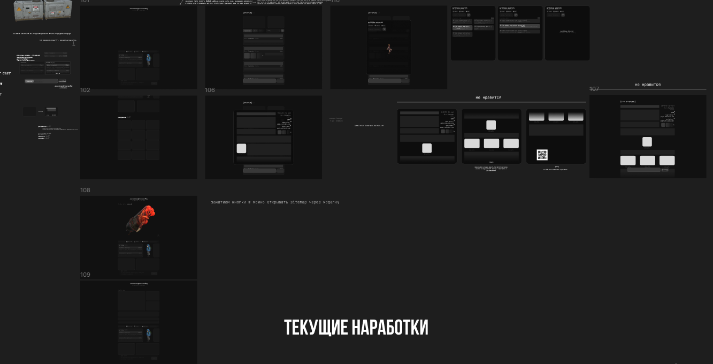
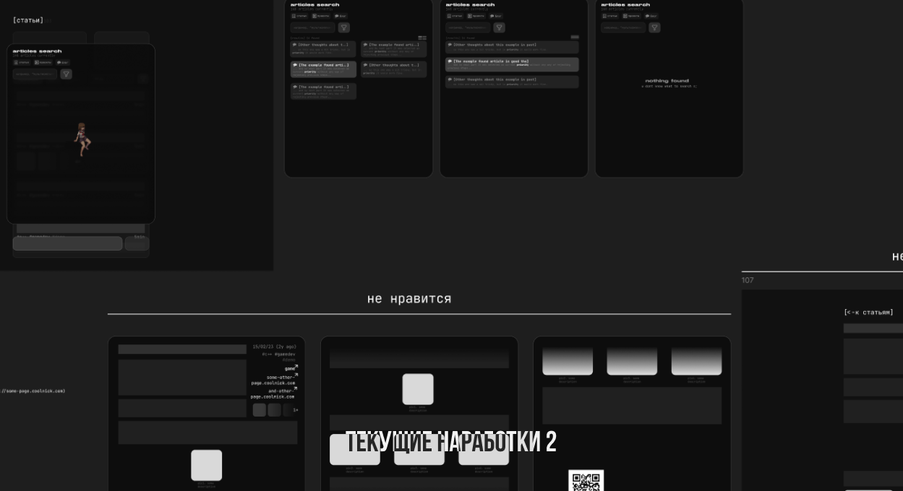
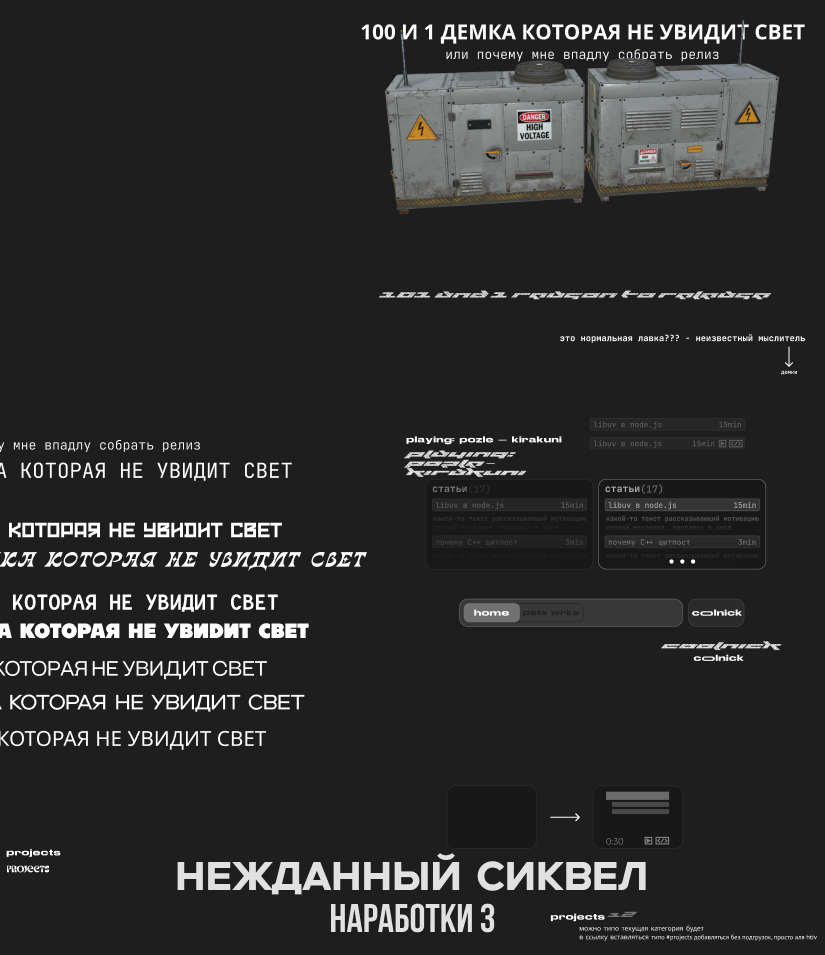

# not personal page

Изначально проект планировался как сайт для друга который увлекается геймдевом. Я всё-же немного из другой сферы, так что ничего умнее, как погонять джейсоны и джипеги в красивом ui/ux, я не придумал.

   

## Дизайн в фигме

<p float="middle">
  
   
  
</p>

## Сетап

> [!IMPORTANT]
> Не забудь .env

```
   NEXT_PUBLIC_NAME="hehe-coolname"
   NEXT_PUBLIC_TIMEZONE="Europe/Moscow"
   NEXT_PUBLIC_CODING_SINCE=1578825717000 (milliseconds)
```

## Компоненты, короче TODO

1. [ ] Pages
   1. [ ] Home
      1. [ ] Different Hero components
         1. [ ] 3D render
         2. [ ] Recent articles or sorted by popularity? (idk which content to load to them)
         3. [ ] Articles list preview
         4. [ ] Projects grid
   2. [ ] Articles
      1. [ ] Tech articles
         1. [ ] Selected article page
         2. [ ] Same page article render (nextjs feature) (article widget)
      2. [ ] Blog
         1. [ ] Selected blog article page
         2. [ ] Same blog article render (nextjs feature) (article widget)
      3. [ ] Projects
         1. [ ] Same page project article render (nextjs feature) (article widget)
2. [ ] Components
   1. [x] Generic
      1. [x] Box (class)
      2. [x] Buttons
         - проверить TODO в button.scss
         1. [x] Default button
      3. [x] Input
      4. [x] Modal
      5. [~] Icon
         - ~ потому что там кривая обовка внутри самого svg и на некоторые объекты обводка не ставится. fill вообще не имплементирован
      6. [x] Image
      <!-- 7. [ ] Popup
      - под вопросом -->
   2. [ ] Specialized
      1. [x] ArticleListElement (list item)
      2. [x] CookiePrompt
         - длина пока 100% width доступного, в модалке (с ref для самоудаления, модалка пока Widgets/CookiePopup не написан) должна быть длина до 500px
      3. [x] Model viewer (orbit controls with one light source)
         1. [~] Пофиксить блок event loop'а загрузкой объекта, мб через воркера или ещё как, саспенс не помогает
         - вроде бы только в сторис зависает, на странице норм
         2. [~] Поставить камеру чуть ближе, свет сделать более мягким и заставить крутиться объект (чек первый коммит связанный с modelviewer.ts)
         - заставил крутиться
         3. [x] Цвет иконки (справа снизу) не хочет меняться ни через родительский color, ни через установку цвета через outline/stroke/color напрямую
         4. [ ] до сих пор баг с неработающим debounce (модель начинает крутится несмотря на то что ты ещё держишь её)
      4. [x] BoxesScrollbar
         - мб есть смысл просто класс fade добавить, но scroll логика мне тоже нужна, может её тоже потом в generic component выделю для реюзабилити
         - fade дёрагнный (js'ом имплементирован)
         - не убран скроллбар на пк, на мобилки он должен оставаться
         - не в виджетах потому что реюз в других Specialized
         - нужно разделить на scrollable компонент и fade хук внутри
      5. [~] ImageList (articles i.e.)
         - не в виджетах потому что реюз в других Specialized
         1. [ ] мб обернуть в Suspense, вроде там перед загрузкой белый фон просто
         2. [ ] нет обработки если ошибка загрузки изображения
         3. [ ] \_temporaryImagesList? Ничего нет более постоянного, чем временное
      6. [x] RadioButtons
         1. [x] Button
         2. [x] ButtonsGroup
      7. [x] ErrorBoundary
      8. [~] VideoPreview
         1. [ ] Storybook если видео/изображение недоступно/ошибка при загрузке
3. [ ] Widgets
   1. [x] CookiePopup
      - проблема в Popup, его фукнционал пока это просто обёртка в виде div.box, нужно взять popup логику из nmgix-components
   2. [x] Bottom clever bar
      - не закончен дизайн, так что элемент без функционала активного помощника на текущей страницы (должен брать функции и данные из стейта страницы + пресеты для каждой страницы где он есть, инфа где он есть по наличию пресета для данной страницы)
   3. [x] Header
      1. [x] Components
         1. [x] ClientDate
   4. [x] Footer
      - проблема в том, что в самом дизайне footer ещё не прототипирован/создан
   5. [~] ArticlesGlobalSearch
      1. [x] переписать на form чтобы не держать инфу в стейте, boxscroll обернуть в компонент со своим стейтом а внутернние его box переделать в инпуты радиогруппы? чтобы форма могла получать данные выбранного элемента
      2. [ ] чтобы только одна модалка могла быть открыта (группы в useKeybind)
      3. [ ] Подключить к реальным заметкам .md формата, скорее всего запрос на апи (не забыть rate limit на тот эндпоинт и какой-то варнинг в видео попапа при привышении лимита)
      4. [x] Components
         1. [x] ResultListRenderer
            1. [x] добавить fade vertical при scroll
      5. [ ] проблема блюра при нелевом scroll (фильтр блюрит весь внутернний контент), при скролле остаётся только маска, блюра всего элемента нет
   6. [~] ArticleList
      1. [ ] обернуть в Suspense + bonus: добавить skeleton анимацию
      2. [ ] юзать ArticleListElement из Specialized
   7. [ ] Article (как same page render поверх предыдущего роута без перехода)
   8. [ ] ImageGallery (prev ImageView)
      1. [ ] возможность открыть на определённом индексе/id (при нажатии на изображение в середине статьи должна открыться галлерея на id этого изображения)
      2. [ ] чтобы только одна модалка могла быть открыта (группы в useKeybind)
   9. [~] SiteMap modal
      1. [ ] чтобы только одна модалка могла быть открыта (группы в useKeybind)
      2. [x] Components
         1. [x] TreeRender
   10. [~] LatestNewsTabs
       1. [ ] Подгружать инфу раз в день по запросу (т.е. если за день никто не заходил, то и не заравшивать, таое в nextjs встроено)
   11. [x] RandomHeroWidget
   12. [x] ArticlesPreview
       - Я понял что это был за компонент в specialized
       1. [ ] Из-за link сейчас стили поломаны
   13. [ ] VideoPreviewGrid
4. [x] Hooks
   1. [~] useFade
      1. [x] сделать и для вертикали, пока хук только для горизонтали
      2. [-] добавить throttle
      3. [ ] иногда в ResultListRenderer блюрится контент при наложении маски
   2. [x] useDebounce
   3. [x] useScrollable (чтобы без шифта скроллить при overflow-x:scroll)
      1. [-] добавить не то чтобы throttle, но чтобы он собирал все wheel ивенты и batch'ил их в один smooth scroll, что-то на увовне debounce, но с batch
   4. [x] useMinuteTimer
5. [ ] Storybook
   1. [ ] Components
      1. [x] Generic
      2. [ ] Specialized
   2. [ ] Widgets
6. [ ] Testing
   1. [ ] Playwright
      1. [ ] Home page
      2. [ ] Articles list
      3. [ ] Blog
      4. [ ] Articles (blog/tech/projects) pages or same page renders
7. [ ] Misc
   1. [ ] Перенести glb в git-lfs (опционально, без lfs пометки лимит до 100мб/файл)
   2. [ ] Подход - desktop-first, так что дизайн не особо будет адаптироваться
