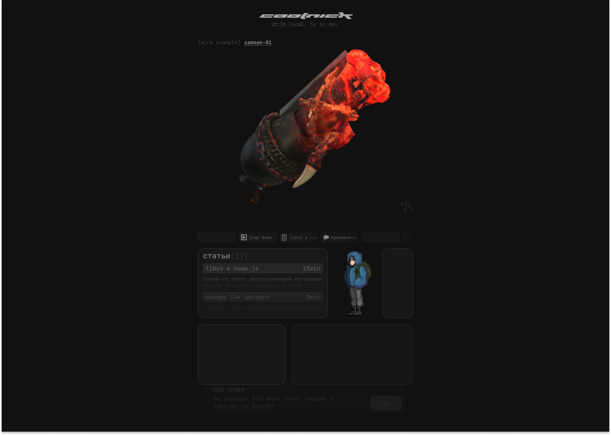

# not personal page

Изначально проект планировался как сайт для друга который увлекается геймдевом. Я всё-же немного из другой сферы, так что ничего умнее, как погонять джейсоны и джипеги в красивом ui/ux, я не придумал.

   

## Дизайн в фигме

<p float="middle">
  
   
  
</p>

# Структура заметок

```
root/
│
├── articles/
│   ├── blog/
│   │   └── article_name/
│   │       └── text.md
│   ├── note/
│   │   └── another_article/
│   │       └── text.md
│   └── project/
│       └── cool_project/
│           ├── text.md
│           └── image.png
│
```

1. blog|note|project (идут по default, можно свои добавлять)
2. обязателен text.md иначе папка будет скипаться внутри serverfunctions, остальные файлы опциональны (обычно это изображения)

# Файл статьи, что писать в шапке

Никаких знаков препинания после значения ключа, никаких запятых и им подобных

Для обычного text.md

```.md
---
   tags: ["idx", "wow", "cool", "news", "ideas", "new", "gamedev"]
   date: 2025-01-03
   title: Новая статья в блоге, опять!!
   TTRmins: 10
---
```

или

```.md
---
   title: Заголовок статьи
   tags: ["news", "cool"]
   date: "2025-01-03"
   TTRmins: 15
   categoryImg: blog
   //(доступны "blog" | "tech-article" | "video"), это тоже убрать, а ещё кавычки должны быть одинарные внутри двойных или наоборот, иначе наткнёшься на https://stackoverflow.com/a/73838504/14889638

   // опционально, эту строчку надо удалить иначе будет ошибка и редирект на /home без объяснений
   textPreview: Какой-то текст, не больше 100? ,кажется, знаков
   imagesSrc: [{ src: "https://cdn.memes.com/up/71558571535638926/i/1736290969647.jpg", alt: "meme 1" }]
---
```

~~хотя почти все ключи опциональны кроме date, кажется~~
в принципе, можно просто text.md бросить и суммарное кол-во articles изменится, но файлы на страничке показываться не будут, по ним можно перейти, но они будут пустые

Для project/ text.md

```.md
---
   tags: ["wow", "cool", "gamedev"]
   date: "2025-01-03"
   title: Test project example
   TTRmins: 3
   textPreview: Тестовый пример кода, посмотрим что из этого выйдет

   videoSrc: https://storage.googleapis.com/gtv-videos-bucket/sample/ForBiggerBlazes.mp4
   imagePlaceholderSrc: https://www.digiseller.ru/preview/1175270/p1_3798188_582bf509.jpg
   relatedTagsIcons: ["code", "blog", "grid-blocks"]
---
```

## Сетап

> [!IMPORTANT]
> Не забудь .env

```
   NEXT_PUBLIC_NAME="hehe-coolname"
   NEXT_PUBLIC_TIMEZONE="Europe/Moscow"
   NEXT_PUBLIC_CODING_SINCE=1578825717000 (milliseconds)
```

## Компоненты, короче TODO

1. [ ] Pages
   1. [x/~] Home
      1. [~] Different Hero components
         1. [x] 3D render
            - компоненты для рендера просто в файле random-hero-widget, возможно для ssr/static не подходит?
         2. [~] Latest News Tabs
            - без данных вовсе, подгрузка с api должна быть
      2. [~] Recent articles or sorted by popularity? (idk which content to load to them)
         - моковые данные, нет подгрузки с api
      3. [~] Articles list preview
         - моковые данные, нет подгрузки с api
      4. [~] Projects grid
         - моковые данные, нет подгрузки с api
   2. [~] Articles
      1. [~] '/' (/articles aka домашняя)
         1. [~] Поиск через ctrl+f (уже есть в компоненте articles-search)
         - сейчас не ищется ничего нормально
   3. [x] Article
      1. [x] Note(s)
         1. [x] Selected article page
         2. [x] Same page article render (nextjs feature) (article widget)
      2. [x] Blog(s)
         1. [x] Selected blog article page
         2. [x] Same blog article render (nextjs feature) (article widget)
      3. [x] Project(s)
         - мб под projects другую страницу сделать?
         - типо с видео в самом начале, например
         1. [x] Selected article page
         2. [x] Same page project article render (nextjs feature) (article widget)
2. [ ] Components
   1. [x] Generic
      1. [x] Box (class)
      2. [x] Buttons
         - проверить TODO в button.scss
         1. [x] Default button
      3. [x] Input
      4. [~] Modal
         - outsideToClose что за переменная?
      5. [~] Icon
         - ~ потому что там кривая обовка внутри самого svg и на некоторые объекты обводка не ставится. fill вообще не имплементирован
      6. [x] Image
      <!-- 7. [ ] Popup
      - под вопросом -->
   2. [x] Specialized
      1. [x] ArticleListElement (list item)
      2. [x] CookiePrompt
         - длина пока 100% width доступного, в модалке (с ref для самоудаления, модалка пока Widgets/CookiePopup не написан) должна быть длина до 500px
      3. [x] Model viewer (orbit controls with one light source)
         1. [~] Пофиксить блок event loop'а загрузкой объекта, мб через воркера или ещё как, саспенс не помогает
         - вроде бы только в сторис зависает, на странице норм
         2. [~] Поставить камеру чуть ближе, свет сделать более мягким и заставить крутиться объект (чек первый коммит связанный с modelviewer.ts)
         - заставил крутиться
         3. [x] Цвет иконки (справа снизу) не хочет меняться ни через родительский color, ни через установку цвета через outline/stroke/color напрямую
         4. [ ] до сих пор баг с неработающим debounce (модель начинает крутится несмотря на то что ты ещё держишь её)
      4. [x] BoxesScrollbar
         - мб есть смысл просто класс fade добавить, но scroll логика мне тоже нужна, может её тоже потом в generic component выделю для реюзабилити
         - fade дёрагнный (js'ом имплементирован)
         - не убран скроллбар на пк, на мобилки он должен оставаться
         - не в виджетах потому что реюз в других Specialized
         - нужно разделить на scrollable компонент и fade хук внутри
      5. [~] ImageList (articles i.e.)
         - не в виджетах потому что реюз в других Specialized
         1. [ ] мб обернуть в Suspense, вроде там перед загрузкой белый фон просто
         2. [ ] нет обработки если ошибка загрузки изображения
         3. [ ] \_temporaryImagesList? Ничего нет более постоянного, чем временное
      6. [x] RadioButtons
         1. [x] Button
         2. [x] ButtonsGroup
      7. [x] ErrorBoundary
      8. [x] VideoPreview
         1. [x] Storybook если видео/изображение недоступно/ошибка при загрузке
3. [ ] Widgets
   1. [x] CookiePopup
      - проблема в Popup, его фукнционал пока это просто обёртка в виде div.box, нужно взять popup логику из nmgix-components
   2. [x] Bottom clever bar
      - не закончен дизайн, так что элемент без функционала активного помощника на текущей страницы (должен брать функции и данные из стейта страницы + пресеты для каждой страницы где он есть, инфа где он есть по наличию пресета для данной страницы)
   3. [x] Header
      1. [x] Components
         1. [x] ClientDate
   4. [x] Footer
      - проблема в том, что в самом дизайне footer ещё не прототипирован/создан
   5. [~] ArticlesGlobalSearch
      1. [x] переписать на form чтобы не держать инфу в стейте, boxscroll обернуть в компонент со своим стейтом а внутернние его box переделать в инпуты радиогруппы? чтобы форма могла получать данные выбранного элемента
      2. [-] чтобы только одна модалка могла быть открыта (группы в useKeybind)
      3. [x] Подключить к реальным заметкам .md формата, скорее всего запрос на апи (не забыть rate limit на тот эндпоинт и какой-то варнинг в видео попапа при привышении лимита)
      4. [x] Components
         1. [x] ResultListRenderer
            1. [x] добавить fade vertical при scroll
      5. [ ] проблема блюра при нелевом scroll (фильтр блюрит весь внутернний контент), при скролле остаётся только маска, блюра всего элемента нет
   6. [~] ArticleList
      1. [x] обернуть в Suspense + bonus: добавить skeleton анимацию
      2. [x] юзать ArticleListElement из Specialized
   7. [x] Article Modal (как same page render поверх предыдущего роута без перехода)
   8. [x] ImageGallery (prev ImageView)
      1. [x] возможность открыть на определённом индексе/id (при нажатии на изображение в середине статьи должна открыться галлерея на id этого изображения)
      2. [x] чтобы только одна модалка могла быть открыта (группы в useKeybind)
   9. [~] SiteMap modal
      1. [ ] чтобы только одна модалка могла быть открыта (группы в useKeybind)
      2. [x] Components
         1. [x] TreeRender
   10. [~] LatestNewsTabs
       1. [ ] Подгружать инфу раз в день по запросу (т.е. если за день никто не заходил, то и не заравшивать, таое в nextjs встроено)
   11. [x] RandomHeroWidget
   12. [x] ArticlesPreview
       - Я понял что это был за компонент в specialized
       - Из-за link сейчас стили поломаны
   13. [~] VideosPreview
       1. [ ] Unload img/video if out of view boundaries
   14. [x] ArticlePages
       - в Widgets потому что будет в blog/,article/,projects/
       1. [x] Default
4. [x] Hooks
   1. [~] useFade
      1. [x] сделать и для вертикали, пока хук только для горизонтали
      2. [-] добавить throttle
      - иногда в ResultListRenderer блюрится контент при наложении маски
   2. [x] useDebounce
   3. [x] useScrollable (чтобы без шифта скроллить при overflow-x:scroll)
      1. [-] добавить не то чтобы throttle, но чтобы он собирал все wheel ивенты и batch'ил их в один smooth scroll, что-то на увовне debounce, но с batch
   4. [x] useMinuteTimer
5. [x] Storybook
   1. [x] Components
      1. [x] Generic
      2. [x] Specialized
   2. [-] Widgets
6. [ ] Testing
   1. [ ] Playwright
      1. [ ] Home page
      2. [ ] Articles list
      3. [ ] Blog
      4. [ ] Articles (blog/tech/projects) pages or same page renders
7. [ ] Misc
   1. [ ] Перенести glb в git-lfs (опционально, без lfs пометки лимит до 100мб/файл)
   2. [ ] Подход - desktop-first, так что дизайн не особо будет адаптироваться
